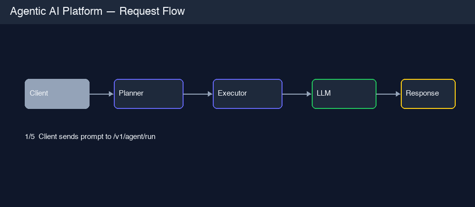

# Agentic AI Platform


An API-first reference platform for building agentic AI systems with explicit planning, tool execution, guardrails, provider abstraction, reliability controls, telemetry, evaluation, and an operations dashboard.

This is not a single-prompt demo. It is a compact production-style agent runtime designed to make each decision inspectable.



## Why This Repo Matters

Agent demos often hide the parts that matter in production: tool authorization, prompt safety, response filtering, fallback behavior, cost tracking, request tracing, and planner regression testing. This repo puts those concerns directly into the request path.

It demonstrates:

- planner -> executor -> provider orchestration
- typed tool calls and explicit trace objects
- prompt and response guardrails
- session memory boundaries
- retry, circuit breaker, and fallback provider behavior
- SQLite telemetry for latency, cost, provider mix, and fallback rate
- evaluation harness for planner behavior
- Streamlit dashboard for operational visibility

## At a Glance

| Capability | Production behavior |
|---|---|
| Orchestration | Planner selects tools, executor runs them, provider generates final answer |
| Tooling | Calculator and document search tools behind typed interfaces |
| Guardrails | PII blocking, tool allowlist, response constraints |
| Reliability | Retry, circuit breaker, provider fallback |
| Observability | Request IDs, latency headers, telemetry events, metrics endpoints |
| Evaluation | Precision/recall/F1 planner benchmark with threshold gate |
| Dashboard | Streamlit runtime analytics with Plotly charts |

## Architecture

```text
Client
  -> FastAPI middleware
  -> prompt guardrails
  -> AgentPlatformService
  -> PlannerAgent
  -> ExecutorAgent
  -> tools
  -> LLMProvider
  -> response guardrails
  -> telemetry store
  -> response with answer, trace, cost, latency, and fallback flag
```

### Layer Map

| Layer | File | Purpose |
|---|---|---|
| API | `app/main.py` | Routes, exception handling, health, metrics |
| Middleware | `app/middleware.py` | Request ID, latency measurement, structured logs |
| Guardrails | `app/guardrails.py` | Prompt and response policy enforcement |
| Memory | `app/memory.py` | In-memory session facts |
| Orchestration | `app/orchestration.py` | Planner, executor, and service flow |
| Providers | `app/providers/` | Mock, OpenAI, Ollama, and Anthropic provider contracts |
| Reliability | `app/reliability.py` | Circuit breaker and retry behavior |
| Telemetry | `app/telemetry.py` | SQLite event store and summary queries |
| Evaluation | `evaluation/run.py` | Planner regression benchmark |
| Dashboard | `dashboard/app.py` | Runtime analytics UI |

## Quick Start

```bash
git clone https://github.com/manjeetkumar53/agentic-ai-platform.git
cd agentic-ai-platform

python3 -m venv .venv
source .venv/bin/activate
pip install -r requirements.txt

uvicorn app.main:app --reload
```

Open Swagger UI at `http://127.0.0.1:8000/docs`.

## Example Request

```bash
curl -s -X POST http://127.0.0.1:8000/v1/agent/run \
  -H "Content-Type: application/json" \
  -d '{"prompt":"What is 128 * 7 using CQRS context?","session_id":"demo-session"}'
```

Example response shape:

```json
{
  "request_id": "3fa85f64-...",
  "answer": "The result is 896.",
  "trace": {
    "planner_reasoning": "Detected numeric intent; Detected architecture/docs lookup intent",
    "selected_tools": ["calculator", "search_docs"],
    "tool_calls": [
      {
        "tool_name": "calculator",
        "tool_input": "128 * 7",
        "tool_output": "896"
      }
    ]
  },
  "latency_ms": 4.2,
  "tokens_in": 120,
  "tokens_out": 35,
  "estimated_cost_usd": 0.0000327,
  "provider": "mock",
  "fallback_used": false
}
```

## Operational Endpoints

| Endpoint | Purpose |
|---|---|
| `GET /health` | Liveness check |
| `POST /v1/agent/run` | Run planner, tools, provider, guardrails, and telemetry |
| `GET /v1/metrics/summary` | Aggregate latency, cost, provider, request, and fallback metrics |
| `GET /v1/eval/events?limit=100` | Recent telemetry events |
| `GET /v1/circuit-breaker/status` | Current reliability state |

## Guardrails

| Guard | Trigger | Action |
|---|---|---|
| `PIIGuard` | Email, phone, SSN, credit card, IPv4 in prompt | HTTP 422, request blocked |
| `ToolAllowlist` | Session requests a tool not in its allowlist | HTTP 422, request blocked |
| `ResponseGuard` | Response too long or contains blocked phrases | HTTP 422, response suppressed |

Guardrail violations return structured error payloads so clients can distinguish safety failures from provider failures.

## Provider Modes

```env
MODEL_PROVIDER=mock
INPUT_PRICE_PER_1M=0.15
OUTPUT_PRICE_PER_1M=0.60
MAX_ATTEMPTS=2
BREAKER_FAILURE_THRESHOLD=3
BREAKER_RECOVERY_TIMEOUT_S=15
TELEMETRY_DB=telemetry.db
```

| Provider | Required configuration |
|---|---|
| `mock` | None, deterministic default |
| `ollama` | `OLLAMA_BASE_URL`, `OLLAMA_MODEL` |
| `openai` | `OPENAI_API_KEY` |
| `anthropic` | `ANTHROPIC_API_KEY` |

## Validation

```bash
pytest -q
python -m evaluation.run
streamlit run dashboard/app.py
```

Planner benchmark sample:

```text
precision       1.0000
recall          1.0000
f1              1.0000
exact_match     1.0000
```

The benchmark exits non-zero if F1 drops below the configured threshold.

## Design Decisions

- **Explicit traces:** planner reasoning, selected tools, and tool outputs are returned for debuggability.
- **Deterministic local mode:** the mock provider keeps tests stable and usable without API keys.
- **Guardrails in the request path:** safety checks happen before and after provider generation.
- **Provider contract:** OpenAI, Anthropic, Ollama, and mock providers sit behind the same interface.
- **Telemetry by default:** cost, latency, fallback, and provider decisions are persisted locally.

## Project Structure

```text
agentic-ai-platform/
├── app/
│   ├── guardrails.py
│   ├── main.py
│   ├── memory.py
│   ├── middleware.py
│   ├── orchestration.py
│   ├── reliability.py
│   ├── telemetry.py
│   ├── providers/
│   └── tools/
├── dashboard/
├── evaluation/
├── scripts/
├── tests/
├── assets/
└── README.md
```

## Production Hardening Backlog

- Replace in-memory session facts with Redis or Postgres-backed memory
- Add tenant-aware tool policies
- Add OpenTelemetry tracing
- Add persisted evaluation history
- Add CI workflow that gates planner regressions
